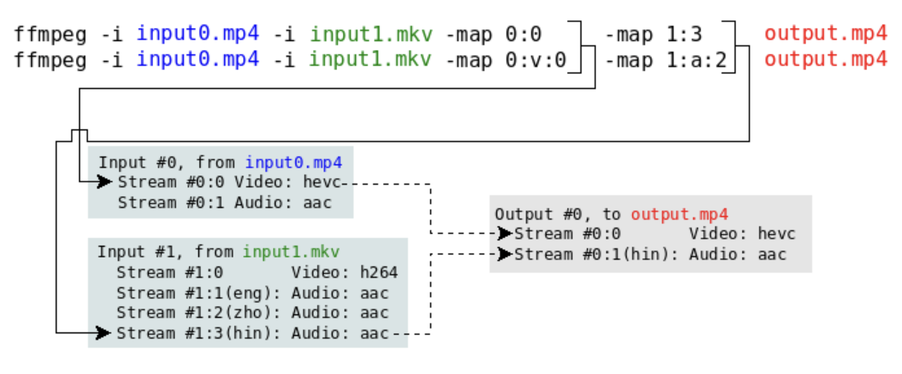

# Linux Audio Video

## MiniDLNA

    apt install minidlna

Read How-To on [wiki.debian.org](https://wiki.debian.org/minidlna) and thumbnails tip on [reddit](https://www.reddit.com/r/selfhosted/comments/fsgtx9/minidlna_config/)

## Convert Audio to AC3 in Movie

Find all movies 

    find . -type f -size +5M -exec exiftool {} + | egrep "File Name|AAC|Audio Channels" > aac.txt

Filter AAC movies. Convert is necessary only for movies with **more channels than 2**. Stereo is OK.

    grep -A 1 -B 1 AAC aac.txt

Conver

    ffmpeg -i video.mkv -map 0 -c:v copy -c:s copy -c:a ac3 -b:a 640k output.mkv

* WARNING - this will convert all audio tracks to AC3 using 640kbps. I don't want this in case of more audio tracks. Check below.

## ffmpeg numbering

`ffmpeg -i Meet_the_Parents_2000_1080p_SK_CZ_ENG.mkv`

    Input #0, matroska,webm, from 'Meet_the_Parents_2000_1080p_SK_CZ_ENG.mkv':
    Metadata:
        encoder         : libebml v1.3.0 + libmatroska v1.4.1
        creation_time   : 2018-09-29T19:31:58.000000Z
    Duration: 01:47:39.77, start: 0.000000, bitrate: 3174 kb/s
        Stream #0:0: Video: h264 (High), yuv420p(progressive), 1920x1080 [SAR 1:1 DAR 16:9], 23.98 fps, 23.98 tbr, 1k tbn, 47.95 tbc (default)
        Stream #0:1(slo): Audio: ac3, 48000 Hz, stereo, fltp, 224 kb/s (default)
        Metadata:
        title           : SK
        Stream #0:2(cze): Audio: ac3, 48000 Hz, stereo, fltp, 224 kb/s
        Metadata:
        title           : CZ
        Stream #0:3(eng): Audio: aac (LC), 48000 Hz, 5.1, fltp
        Metadata:
        title           : ENG
        Stream #0:4(cze): Subtitle: subrip
        Metadata:
        title           : CZ
        Stream #0:5(eng): Subtitle: subrip
        Metadata:
        title           : ENG

`ffmpeg -i Meet_the_Parents_2000_1080p_SK_CZ_ENG.mkv -map 0 -c:v copy -c:s copy -c:a:0 copy -c:a:1 copy -c:a:2 ac3 -b:a:2 640k output.mkv`

Copy AUDIO track 0 `(a:0)` which is Audio track from (global) list `0:1`.  
Copy AUDIO track 1 `(a:1)` which is Audio track from (global) list `0:2`.  

`0:1` and `0:2` is numbering of **all** tracks. Global list shows audio and video tracks **together**. So numbers in format 0:x are all tracks (video or audio track doesn't matter).

Now, when I tell ffmpeg track is video :v or audio :a, **track numbering will change and beginning always from 0 for :v or :a!**

So `-c:a:0 copy` (audio tracks only) means copy track 0:1 without changes (just do that for tracks I don't want to change) and `-c:a:2 ac3 -b:a:2 640k` means convert `0:3` (for example `audio eng aac`) to ac3 with bitrate 640kbps.

In case movie has more tracks and I want to delete first two and convert other to AC3:

    ffmpeg -i Zodiac.2007.DC.mkv -map 0 -map -0:a:0 -map -0:a:1 -c:v copy -c:s copy -c:a ac3 -b:a 640k output.mkv

[SOURCE on Stack Overflow](https://stackoverflow.com/questions/38161697/how-to-remove-one-track-from-video-file-using-ffmpeg)
