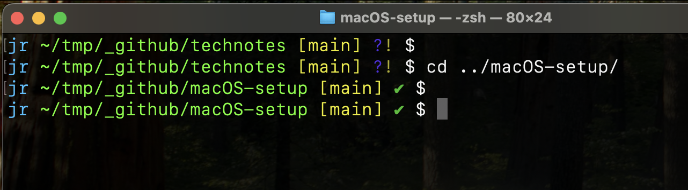
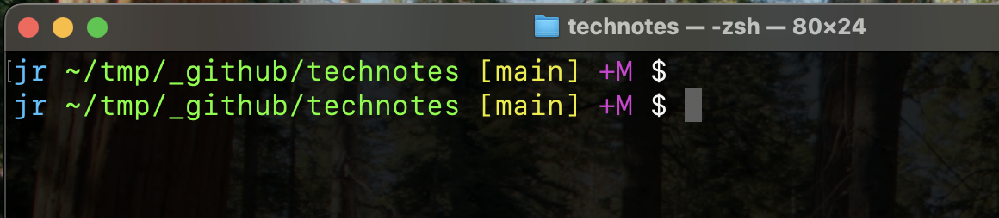
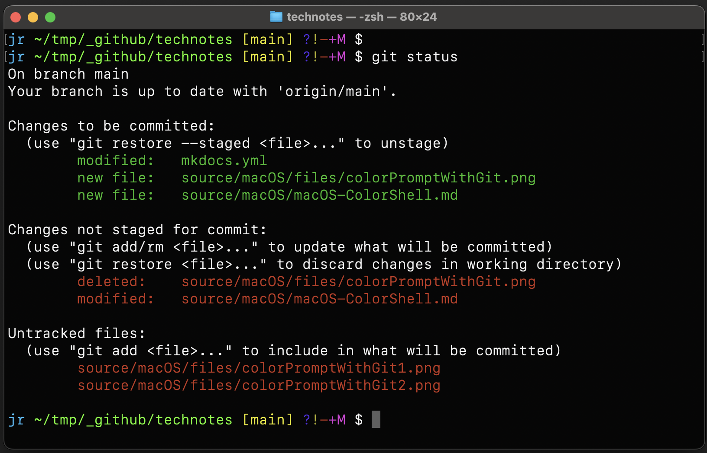

# macOS Color Shell with Git status

## Show Colors in Terminal

    #!/bin/bash

    color=0;
    while [ $color -lt 245 ]; do
        echo -e "$color: \\033[38;5;${color}mhello\\033[48;5;${color}mworld\\033[0m"
        ((color++));
    done  

## Setup in ~/.zshrc

    git_status() {
        # Early return if not in a git repository
        git rev-parse --is-inside-work-tree &>/dev/null || return
            
        local status_symbols=("")
        local git_status="$(git status --porcelain -b 2>/dev/null)"
        local working_tree=$(echo "$git_status" | tail -n +2)  # Skip the first line (branch info)

        # Branch status with colors
        if echo "$git_status" | grep -q "ahead"; then
            status_symbols+=("%F{cyan}?~F~Q%f")    # Cyan for ahead
        elif echo "$git_status" | grep -q "behind"; then
            status_symbols+=("%F{yellow}?~F~S%f")  # Yellow for behind
        elif echo "$git_status" | grep -q "diverged"; then
            status_symbols+=("%F{red}?~F~U%f")     # Red for diverged
        fi

        # Working tree status with colors
        if [[ -z "$working_tree" ]]; then
            status_symbols+=("%F{green}?~\~T%f")   # Green for clean
        else
            # Check for untracked files
            if echo "$git_status" | grep -q "^??"; then
                status_symbols+=("%F{blue}?%f")    # Blue for untracked
            fi
            # Check for unstaged modifications
            if echo "$git_status" | grep -q "^.M"; then
                status_symbols+=("%F{yellow}!%f")  # Yellow for modified
            fi
            # Check for unstaged deletions
            if echo "$git_status" | grep -q "^.D"; then
                status_symbols+=("%F{red}-%f")     # Red for deleted
            fi
            # Check for staged additions
            if echo "$git_status" | grep -q "^A"; then
                status_symbols+=("%F{magenta}+%f") # Magenta for added
            fi
            # Check for staged modifications
            if echo "$git_status" | grep -q "^M"; then
                status_symbols+=("%F{magenta}M%f") # Magenta for staged modifications
            fi
            # Check for staged deletions
            if echo "$git_status" | grep -q "^D"; then
                status_symbols+=("%F{magenta}D%f") # Magenta for staged deletions
            fi
            # Check for renamed files
            if echo "$git_status" | grep -q "^R"; then
                status_symbols+=("%F{cyan}R%f")    # Cyan for renamed
            fi
            # Check for copied files
            if echo "$git_status" | grep -q "^C"; then
                status_symbols+=("%F{cyan}C%f")    # Cyan for copied
            fi
            # Check for merge conflicts
            if echo "$git_status" | grep -q "^U\|^.U\|^AA\|^DD"; then
                status_symbols+=("%F{red}?~I| %f")     # Red for conflicts
            fi
        fi

        echo " ${(j::)status_symbols} "
    }

    function parse_git_branch() {
        git branch 2> /dev/null | sed -n -e 's/^\* \(.*\)/[\1]/p' || return
    }

    COLOR_DEF=$'%f'        ### White
    COLOR_USR=$'%F{039}'   ### Cyan
    COLOR_DIR=$'%F{082}'   ### Green
    COLOR_GIT=$'%F{11}'    ### Yellow
    PROMPT='${COLOR_USR}%n ${COLOR_DIR}%~${COLOR_GIT} $(parse_git_branch)${COLOR_DEF}$(git_status)$ '

[Source on SO](https://unix.stackexchange.com/questions/124407/what-color-codes-can-i-use-in-my-bash-ps1-prompt/124409#124409)

[Linux version in ~/.bashrc](files/bashrc.txt)
