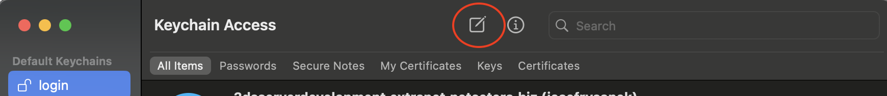
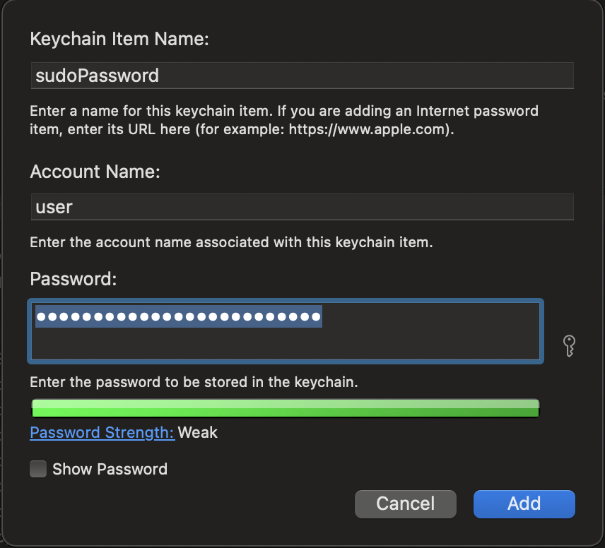

# macOS Shell Scripting

## Fill password for sudo in shell script

DANGER! Do not borrow your terminal to anybody. :slight_smile:

Open Keychain Access, select login keychain and use Create New ...

Create alias

Use it

    PASS=$(security find-generic-password -l "sudoPassword" -a jr -w | tr -d '\n')
    # -l = name of item in Keychain
    # -a = account name
    # -w = return password only
    echo "$PASS" | sudo -S whoami

Allow `security` utility to access `Keychain` **always** ...
